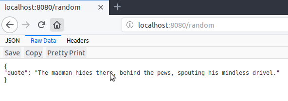

[](https://godoc.org/github.com/bruno-chavez/restedancestor)
[](https://goreportcard.com/report/github.com/bruno-chavez/restedancestor)
[](https://travis-ci.org/bruno-chavez/restedancestor)

`restedancestor` is a pretty simple REST API, delivers quotes from the Ancestor of the Darkest Dungeon in JSON format.

##  Online

`restedancestor` is currently online at https://restedancestor.herokuapp.com, skip to the Routes section to what routes can take requests.

## Local Use

`restedancestor`'s master branch can be used to deploy a local copy for development, testing or for whatever fits your needs, you can either download a binary or compile it yourself, either way follow instructions below.

### Executables:

`restedancestor` can be downloaded for every OS [here](https://github.com/bruno-chavez/restedancestor/releases) simply click on the one that has your OS and architecture on its name.

After its downloaded run the executable and start making requests!

#### From source code:

Requires Go to be installed on your machine. You can install Go from
[here](https://golang.org/doc/install).

The [Gorilla mux](https://github.com/gorilla/mux) package is also needed if building from source, be sure to install it before installing `restedancestor`.

Once installed, and with a correctly configured GOPATH, on a terminal type:

```
$ go get github.com/bruno-chavez/restedancestor
```

Then go to:

```
$GOPATH/src/github.com/bruno-chavez/restedancestor
```

And last, on a terminal type:

```
$ go install
```

##### Usage

Once installed and depending on how you installed the api should see a message like this:

```
$ restedancestor
Welcome to restedancestor, the API is running in a maddening fashion!
The Ancestor is waiting and listening on port 8080 of localhost
```

You can communicate with the API in various ways, for example going to your browser and typing on your serach bar `localhost:8000`, followed with one of the routes listed on the Routes seccion, if succesful you should see something like this:



There are more complete ways of doing requests to the API, and choosing one depends completly on preference, if you like Desktop Apps [Postman](https://www.getpostman.com/) is a pretty powerful tool, prefer web tools? check [Hurl it](https://www.hurl.it/), like CLI apps? [HTTPie](https://httpie.org/) is good enough for the job.

## Routes

### /random:

#### GET:

Responds with a JSON body with a random quote in it.

```
HTTP/1.1 200 OK
Content-Type: application/json
Date: Mon, 04 Jun 2018 09:46:36 GMT
Content-Length: 67

{
  "quote": "Towering. Fierce. Terrible. Nightmare made material."
}
```

#### OPTIONS:

Responds with a header where it shows the available type request for that route
```
HTTP/1.1 200 OK
Allow: GET,OPTIONS
```

### /search/{word}:

#### GET:

Where {word} is the word that wants to be found in the database.

For example requesting a GET methond on /search/prince will return a JSON body and a NotFoundStatus Header like this:

```
HTTP/1.1 404 Not Found
Content-Type: application/json
Date: Mon, 04 Jun 2018 09:37:24 GMT
Content-Length: 70

{
  "code": "404",
  "message": "'prince' was not found in the database"
}
```

But requesting at /search/swine will return a JSON body with all the quotes that the word was found on and a OKStatus Header:

```
HTTP/1.1 200 OK
Content-Type: application/json
Date: Mon, 04 Jun 2018 09:39:54 GMT
Content-Length: 99

[
  {
    "quote": "To prosecute our war against the swine, we must first scout their squalid homes."
  }
]
```

#### OPTIONS:

Responds with a header where it shows the available type request for that route
```
HTTP/1.1 200 OK
Allow: GET,OPTIONS
```

### /all:

#### GET:

Responds with a all the quotes available in the API.

```
HTTP/1.1 200 OK
Content-Type: application/json
Date: Mon, 04 Jun 2018 09:47:14 GMT
Transfer-Encoding: chunked

[
{
"quote": "Brigands have the run of these lanes, keep to the side path, the Hamlet is just ahead."
},
{
"quote": "Dispatch this thug in brutal fashion, that all may hear of your arrival!"
},
...
}
]
```

#### OPTIONS:

Responds with a header where it shows the available type request for that route
```
HTTP/1.1 200 OK
Allow: GET,OPTIONS
```


## Notes

This is a pretty small and niche project, created mainly to have fun,
so do that!

Only tested on Linux.

Sister project of [ancestorquotes](https://github.com/bruno-chavez/ancestorquotes).

Current version: `0.4`

## Contribute

Found an bug or an error? Post it in the [issue tracker](https://github.com/bruno-chavez/ancestorquotes/issues).

Want to add an awesome new feature? [Fork](https://github.com/bruno-chavez/ancestorquotes/fork) this repository and add your feature, then send a pull request.

## License
The MIT License (MIT)
Copyright (c) 2018 Bruno Chavez
